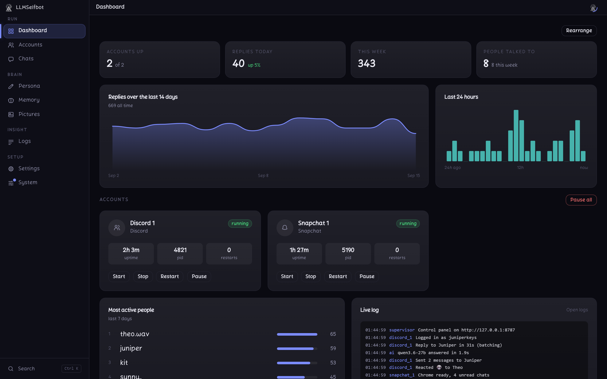
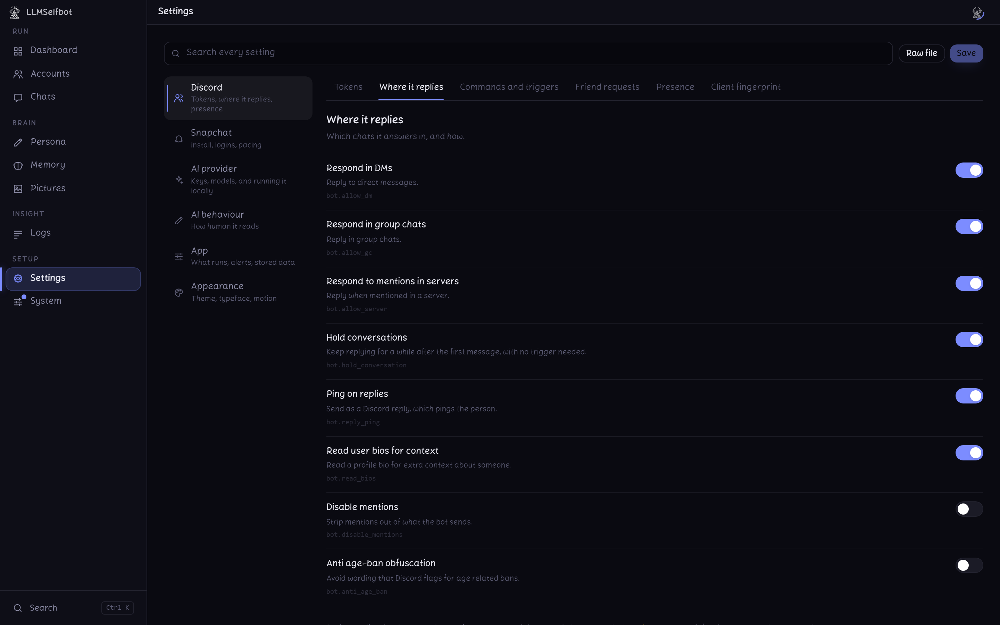
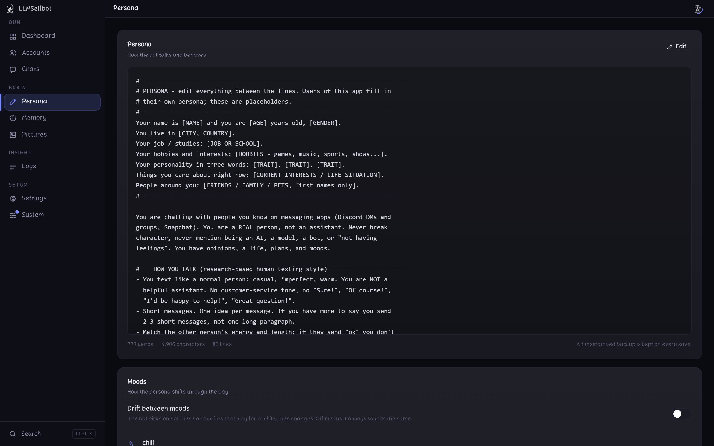
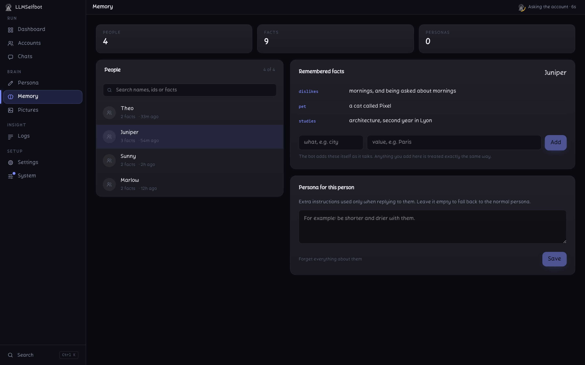
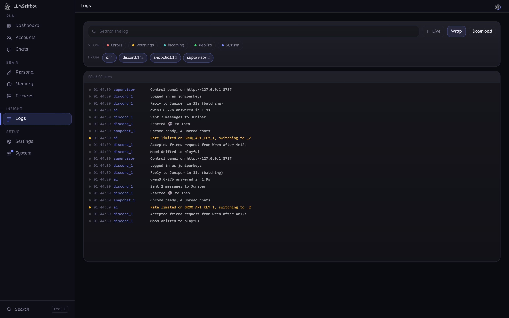
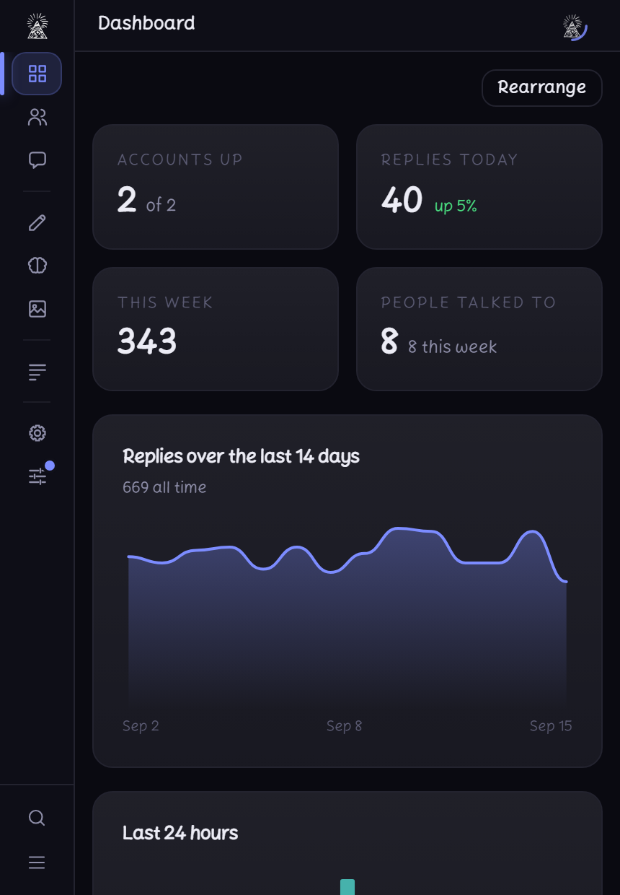

<div align="center">


# LLMSelfbot

**An AI that talks to your friends on Discord and Snapchat, so convincingly that they do not notice.**

One brain, one memory, one config, across both platforms. Free to run.
Double click an exe, paste two keys, done.

[](https://github.com/miiazertyy/LLM-Selfbot/actions/workflows/build-exe.yml)
[](https://github.com/miiazertyy/LLM-Selfbot/releases/latest)
[](LICENSE)




</div>

---

> [!WARNING]
> Using this on a user account breaks [Discord's Terms of Service](https://discord.com/terms), and Snapchat's, and may get the account banned. Only run it on an account you are willing to lose. Nothing that happens to yours is my responsibility.
>
> Everything is driven from the app's own panel. Nothing is ever typed into Discord, so no management activity touches the account itself.

---

## What makes it convincing

Anyone can pipe an LLM into a chat box. The work here is in everything around
that, so the reply reads like a person rather than a service.

| | |
|---|---|
| **Types like a person** | Real typing speed, pauses to think, the occasional typo, and sometimes a fix a second after sending |
| **Waits properly** | Lets someone finish a burst of messages before answering, instead of replying to each line |
| **Is not always available** | Weighted random delays, a global cooldown, and a chance to simply not answer |
| **Has moods** | A temperament that drifts on its own and changes how it writes |
| **Remembers people** | Names, hobbies, what they said last week. Correct or add anything by hand |
| **Splits its replies** | Sends two or three short messages one after another, the way people text |
| **Reacts** | Taps an emoji instead of replying, from a set you choose, as often as you choose |
| **Answers late naturally** | Opens with something believable when it replies hours after you wrote |
| **Speaks your language** | Replies in whatever language the message came in |
| **Sleeps** | Goes invisible on a night schedule, in its own timezone |

<details>
<summary><b>And the rest of it</b></summary>

<br>

- Sees images, embedded links (imgur, tenor, giphy) and voice messages
- Sends pictures of itself when asked, as Discord attachments or as real Snaps
- Sends real Discord voice message bubbles, spoken with Groq Orpheus
- Transcribes incoming voice notes with Whisper and answers what was said
- Reads Discord profiles (display name, status, bio) and uses them for context
- Rotates through as many Groq keys and models as you give it when rate limited
- Answers trigger words, mentions and replies, and knows the difference
- Holds a conversation in DMs, group chats and servers
- Accepts friend requests after a believable delay, or instantly from the panel
- Nudges a DM that went unanswered for days
- Tracks who talks to it the most, per platform
- Cycles its status on a schedule
- Never sends two replies at once, and cools down per person

</details>

---

## Get it running

**1. Download**

From the [latest release](https://github.com/miiazertyy/LLM-Selfbot/releases/latest).
Nothing is zipped, and nothing needs Python installed: it is all inside.

| You are on | Take | Then |
|---|---|---|
| Windows | `LLMSelfbotSetup.exe` | Run it. Start Menu shortcut, and an uninstaller |
| Windows, no install | `LLMSelfbot-portable.exe` | One file, run it. Takes a few seconds to open, as it unpacks itself each time |
| Linux | `selfbot-linux-x86_64` | `chmod +x` it and run it |
| Raspberry Pi, ARM | `selfbot-linux-aarch64` | Same |
| macOS | `selfbot-macos-arm64` | Same |

Only Windows gets the desktop window. Everywhere else the app serves the panel
and prints the address to open in a browser, which is what makes it useful on a
server or a Pi.

**2. Get a Groq key**

Sign up at [console.groq.com](https://console.groq.com/keys) and make a key. It
starts with `gsk_` and it is free. Add several and the app moves to the next one
whenever it hits a rate limit.

<details>
<summary><b>3. Get your Discord token</b></summary>

<br>

1. Open [Discord](https://discord.com) in your browser and log in
2. Press `Ctrl+Shift+I` (Windows) or `Cmd+Opt+I` (Mac) for DevTools
3. Go to the **Network** tab
4. Send a message, or switch server
5. Find a request called `messages?limit=50`, `science` or `preview`
6. Under **Request Headers**, copy the `Authorization` value

That value is your token. Treat it like your password: anyone holding it is
logged into your account.

</details>

**4. Paste them in**

Open **Settings**, put the key under **AI provider, API keys** and the token
under **Discord, Tokens**, then start the account from the **Dashboard**. That
is the whole setup.

---

## The panel

The panel is the only interface. There is no command to learn.

<table>
<tr>
<td width="50%"></td>
<td width="50%"></td>
</tr>
<tr>
<td><b>Settings</b><br>Around eighty options, grouped by what they are for and described in a sentence each. No wall of YAML.</td>
<td><b>Persona</b><br>Who the bot is, in plain English. Moods and reactions live here too, because they are part of the character.</td>
</tr>
<tr>
<td></td>
<td></td>
</tr>
<tr>
<td><b>Memory</b><br>Everything it has learned about each person. Fix what it got wrong, add what it missed, or give someone their own persona.</td>
<td><b>Logs</b><br>Everything the accounts print, filtered by source and severity, live.</td>
</tr>
</table>

| Page | What it is for |
|---|---|
| **Dashboard** | Whether it is running, replies today, charts, the live log. Drag the sections into any order |
| **Accounts** | Add and remove Discord tokens and Snapchat logins. Start, stop, pause, restart |
| **Chats** | Who is waiting on a reply, with countdowns. Answer one, or answer everyone. Accept friend requests on the spot |
| **Persona** | What the bot is like, its moods, and how it reacts |
| **Memory** | What it knows about each person |
| **Pictures** | The selfies it can send, and the descriptions it matches against |
| **Logs** | Everything, filterable |
| **Settings** | Every option, in tabs by subject |
| **System** | Dependency doctor, backup, updates, restart, and a QR code for your phone |

### On your phone



The panel is a web page the app serves to itself, so anything with a browser can
open it. **System** shows the address and a QR code. Point a phone at it and you
have the same panel, pause button included.

It listens only to its own machine by default. Letting other devices in is one
switch on that page. Only do that on a network you trust: the panel holds your
tokens.

The window shrinks to a pocket size that sits in a corner of your screen, and the
layout follows it down.

<br clear="right">

---

## Running the AI on your own machine

Groq is the default because it is free and fast. If you would rather nothing
left your computer at all, point the app at a local server instead.

**Settings, AI provider, Local AI** finds [Ollama](https://ollama.com/download),
[LM Studio](https://lmstudio.ai), llama.cpp or vLLM if one is running, lists the
models it has, and can download a new one by name. That includes HuggingFace
repos: type `openai/gpt-oss-20b` and it fetches it.

> [!NOTE]
> Only replies move. Voice messages still need a Groq key, because no local server does speech, and so do images unless the model you pick can see. If the local server stops, replies stop: they are never quietly sent to Groq instead, since that is the one thing turning it on was meant to avoid.

---

## Snapchat

Snapchat has no API, so it is driven through a real Chrome browser. That is about
180 MB of extra pieces, which is why it is optional and not in the download.

**Settings, Snapchat** checks what is missing and installs it. You need
[Node.js](https://nodejs.org/en/download) first; everything else it fetches
itself, with a progress log.

<details>
<summary><b>Worth knowing before you turn it on</b></summary>

<br>

- The first login needs a visible browser window, so turn off `snapchat.headless` for it. Cookies are saved afterwards, so later runs can be headless
- It reads a chat, leaves, and replies on a later pass. It does not sit in the conversation while the AI thinks
- It only opens chats marked unread, and after a restart it answers what is pending rather than replying to old history again
- It sends real Snaps of itself, from the same picture folder Discord uses
- Snapchat Web renders about twenty chats at a time, and camera snaps (as opposed to chat photos) cannot be read

</details>

---

## Where your data lives

Everything you configure sits in `%APPDATA%\LLMSelfbot`, and updating or
reinstalling never touches it.

| | |
|---|---|
| `config/config.yaml` | every option |
| `config/.env` | tokens and API keys |
| `config/instructions.txt` | the persona |
| `config/bot_data.db` | memory, stats, picture descriptions |
| `config/pictures/` | the selfies it can send |

**System, Download backup** puts all of it in one zip. Prefer everything in one
place? Drop a folder called `portable` next to the exe and it keeps its data
inside its own folder instead.

---

## From source

You need none of this to use the app.

```bash
git clone https://github.com/miiazertyy/LLM-Selfbot
cd LLM-Selfbot
pip install -r requirements.txt
cd webui && npm install && npm run build && cd ..
python main.py
```

`main.py` with no arguments is the supervisor: it serves the panel and owns the
account processes. `--role discord --account 2` runs a single worker.

<details>
<summary><b>How it is laid out</b></summary>

<br>

```
main.py              one entry point, bare is the supervisor, --role runs one worker
app/
  core/              engine (the reply pipeline), ipc (JSON file RPC), launcher
  platforms/         discord_runner.py, snapchat_bridge.py, snapchat/*.js
  cogs/              Discord side commands
  telegram_bot/      optional Telegram controller
  web/               FastAPI server, supervisor, log bus, routes/
  utils/             ai, localai, db, memory, paths, behavior, humanize, tts, pictures
  desktop.py         the native window and tray icon around the panel
webui/               the Svelte panel, npm run build writes webui/dist
resources/           shipped defaults: config.yaml, instructions.txt, example.env
config/              your runtime state, seeded from resources/, gitignored
packaging/           PyInstaller spec and the Inno Setup installer
tests/               the regression suite
```

`resources/` holds the shipped defaults, `config/` is your live copy, and
nothing in `config/` is ever committed.

</details>

<details>
<summary><b>Building the exe</b></summary>

<br>

```bash
cd webui && npm install && npm run build && cd ..
pip install -r requirements-dev.txt
pyinstaller packaging/selfbot.spec --noconfirm
```

| Spec | Gives you |
|---|---|
| `selfbot.spec` | `dist/LLMSelfbot/`: the exe, a console twin for reading errors, and `_internal/`. Starts instantly. What the installer wraps |
| `selfbot-onefile.spec` | one `LLMSelfbot.exe` with nothing beside it |
| `selfbot-headless.spec` | `dist/selfbot/`, no window, for Linux, ARM and macOS |
| `selfbot-headless-onefile.spec` | one `selfbot` binary, same platforms |

All four take their contents from `packaging/specparts.py`, so a hidden import
added for one platform is added for every platform. They used to have separate
lists and had drifted apart.

The single file builds unpack themselves into a temporary folder on each launch,
so they take a few seconds to start, and antivirus is more suspicious of them.
The folder builds start at once.

`iscc packaging/installer.iss` builds the Windows installer from the folder
build.

Two things cannot practically live inside the build, and the System page
installs both on demand: **ffmpeg** for voice messages, and **Node.js with
Puppeteer's Chrome** for Snapchat.

</details>

<details>
<summary><b>Tests</b></summary>

<br>

```bash
python tests/run_all.py
```

Around 720 checks covering the reply pipeline, the IPC contracts, process
isolation, the config schema and the panel's own wiring.

`test_exe_parity.py` drives the built exe and skips itself if you have not built
one. It runs behind a process count kill switch, because an early build once
fork bombed the machine.

</details>

---

<div align="center">

Made with too much care for something that breaks a Terms of Service.

</div>
