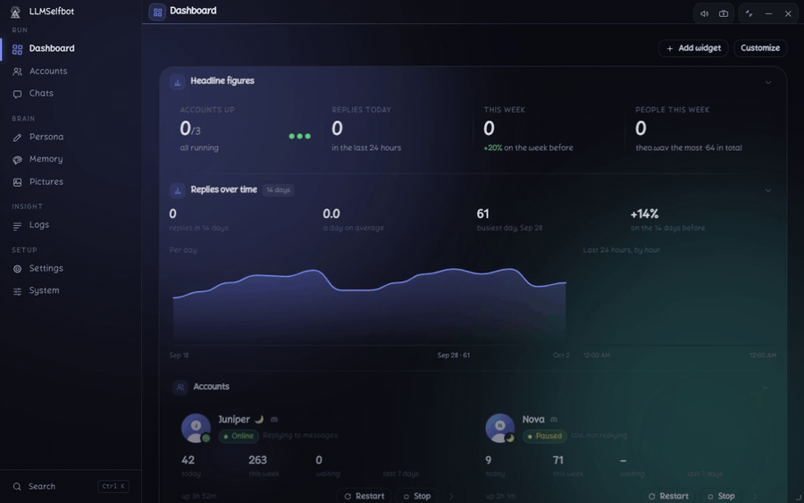
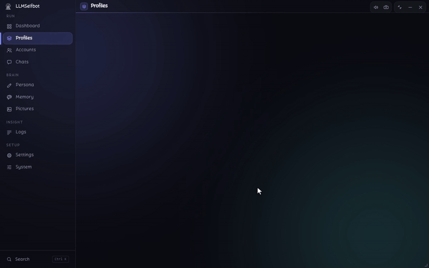
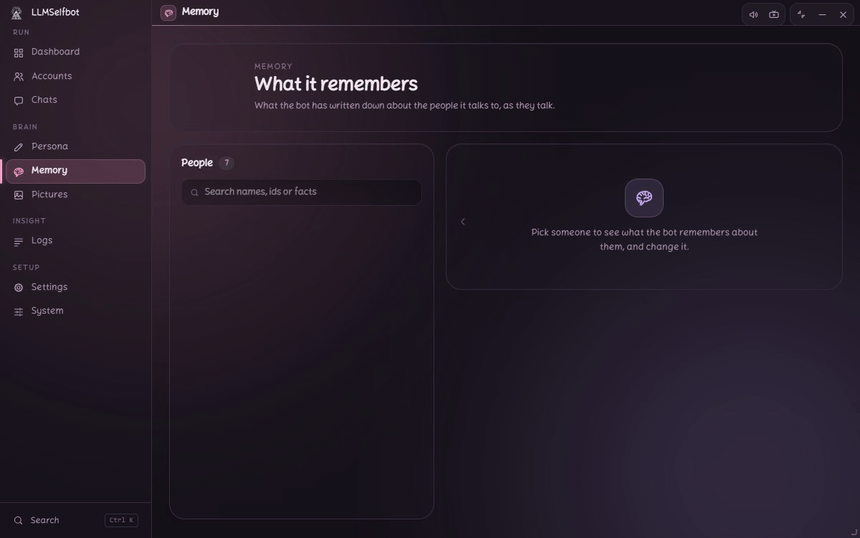
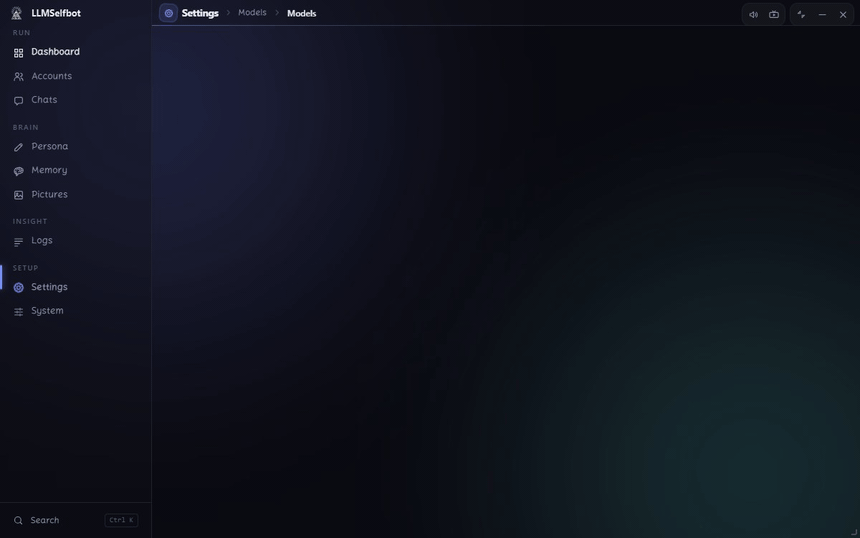
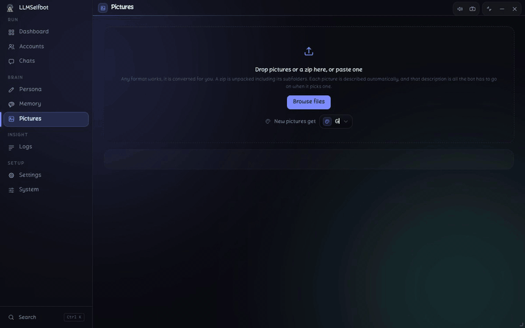
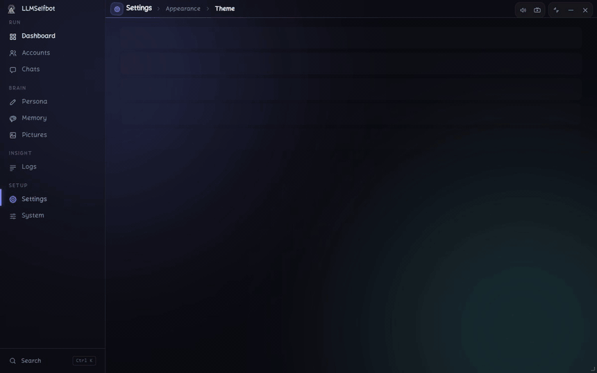
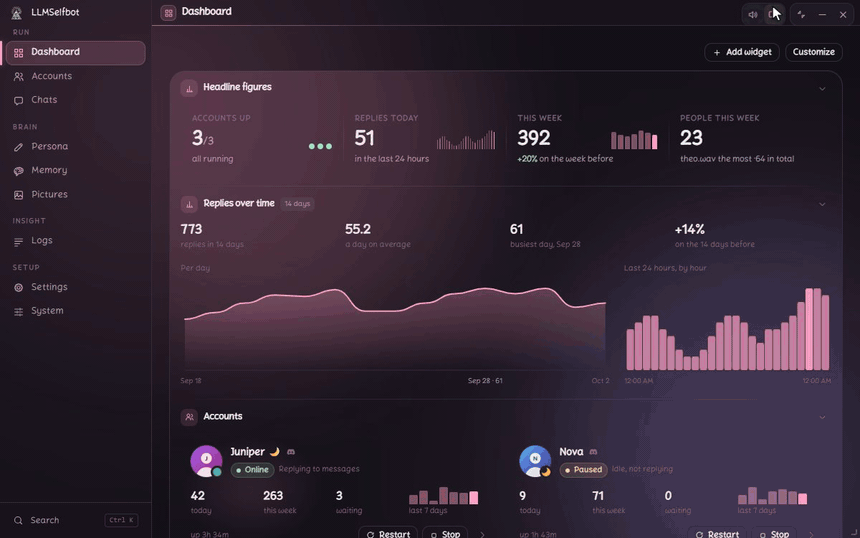
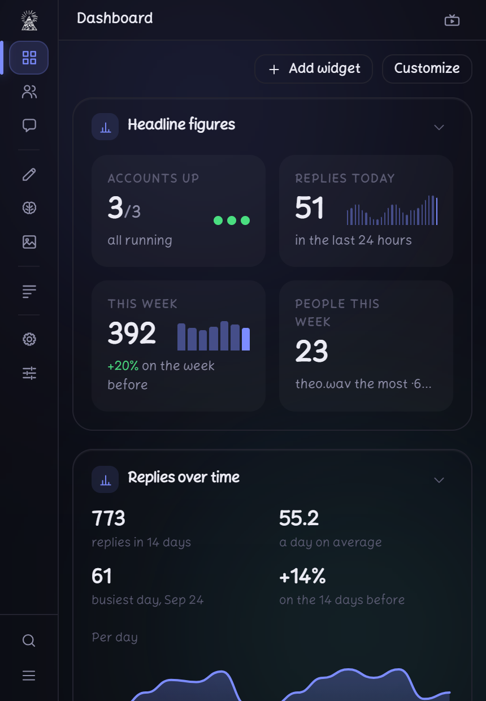

<div align="center">


# LLMSelfbot

**An AI that answers your Discord and Snapchat messages, and texts like a real person while it's at it.**

Give it a personality, add an account, and leave it running.<br>
Free with a Groq key. One download, nothing else to install.

[](https://github.com/miiazertyy/LLM-Selfbot/releases/latest)
[](https://github.com/miiazertyy/LLM-Selfbot/actions/workflows/build-exe.yml)
[](LICENSE)




[What it does](#what-it-does) · [The app](#the-app) · [Setup](#setup) · [Local AI](#running-the-ai-on-your-own-computer) · [Snapchat](#snapchat) · [Building it](#building-it-yourself)

</div>

<br>

> [!WARNING]
> Selfbots break Discord's Terms of Service, and Snapchat's, and accounts do get banned for it. Only run it on an account you're fine losing. What happens to yours is on you.

## What it does

You write a character: a name, an age, where they live, how they text, what they're into. Then you add a Discord
account and it answers DMs as that character. Snapchat works too, with the same character and the same memory.

Getting an AI to write a reply is the easy part. Making it feel like you're texting a person is the hard part, and
that's what most of this project is:

- It waits for people to finish double texting, then answers everything at once
- It isn't always around. Replies come after a random wait, some messages never get one, and at night it goes offline in its own timezone
- It types at a real speed, stops to think, and fixes the odd typo a second after sending
- It sends two or three short texts instead of one long paragraph
- It remembers people: names, plans, what they said last week. You can read and edit all of it
- Its mood drifts through the day and changes how it writes
- When it answers hours late, it opens with an excuse that makes sense
- It answers in whatever language you wrote in
- Sometimes it just reacts with an emoji
- It reads pictures, gifs, links and voice messages, and sends selfies, videos and voice messages back

<details>
<summary><b>And the smaller stuff</b></summary>

<br>

- A selfie can get a Snapchat style caption, the time, a few emoji or a filter. The AI picks what fits, and only on the accounts you allow
- Filters for your pictures, by hand or on every new one
- Videos of any kind become MP4, made smaller when they're too big to send, and are described from their frames and sound
- Reads Discord profiles (name, status, bio) for context
- Knows the difference between a DM, a group chat, a mention and a reply
- Accepts friend requests after a believable wait, or right away from the app
- Texts people who went quiet for a few days
- Never sends two replies at once, and cools down per person
- Changes its status on a schedule
- Moves to the next key or model when one hits a rate limit
- Can be controlled from Telegram

</details>

## The app

Everything happens in the app. You never type commands into Discord, and you never have to open a config file
(you still can).

<table>
<tr>
<td width="50%"></td>
<td width="50%"></td>
</tr>
<tr>
<td><b>Profiles</b><br>Run more than one bot: each profile has its own persona, pictures, memory and settings, on the accounts you give it.</td>
<td><b>Memory</b><br>What it knows about each person. Fix what it got wrong, add what it missed.</td>
</tr>
<tr>
<td></td>
<td></td>
</tr>
<tr>
<td><b>Models</b><br>Which AI does which job, and what takes over when one is busy.</td>
<td><b>Pictures</b><br>The selfies and videos it can send, what's in each one, and filters.</td>
</tr>
</table>

| Page | What's on it |
|---|---|
| **Dashboard** | Is it running, replies today, charts, the live log. Drag the sections around |
| **Profiles** | Each bot you run, which of them are running and on which accounts. Make one, copy one, move accounts between them, crop its face |
| **Accounts** | Add Discord and Snapchat accounts. Start, stop, pause, restart, and pick each one's profile |
| **Chats** | Who's waiting on a reply and how long until it comes. Answer one or all of them now, accept friend requests |
| **Persona** | Who a profile is, its moods and how it reacts |
| **Memory** | What it knows about everyone |
| **Pictures** | The selfies and videos it sends, and their filters |
| **Logs** | Everything the accounts print, filtered however you want |
| **Settings** | Every option, grouped by what it's for, one line each |
| **System** | Checks what's missing, backups, updates, and a QR code to open the app on your phone |

Every page opens with its own little animation, and every button, switch and slider makes a sound. Both can be
turned off.

### Make it yours



Six themes, four backgrounds, three panel styles and a few typefaces, or upload your own font.

### Big Picture Mode



A full screen view to leave open on a second monitor. When someone is waiting on a reply, they take over the
screen: the conversation, the reply being written, and the colours of their profile behind it. The rest of the time
it goes through today's numbers, your accounts, someone it remembers, and so on.

Open it with the button at the top of the app or **Ctrl+Shift+B**. Esc leaves.

### On your phone



The app is a web page it serves to itself, so anything with a browser can open it. **System** shows the address
and a QR code. Scan it and you've got the whole thing on your phone, pause button included.

By default only your own computer can open it. Letting other devices in is one switch on that same page. Only turn
it on at home: the app holds your tokens.

The window can also shrink down to a small panel that sits in a corner of your screen.

<br clear="right">

## Setup

**1. Download it** from the [latest release](https://github.com/miiazertyy/LLM-Selfbot/releases/latest). Python and
everything else is already inside.

| You're on | Get | Then |
|---|---|---|
| Windows | `LLMSelfbotSetup.exe` | Run it. You get a Start Menu shortcut and an uninstaller |
| Windows, no install | `LLMSelfbot-portable.exe` | Just run it. It takes a few seconds to open since it unpacks itself every time |
| Linux | `LLMSelfbot-linux-x86_64` | `chmod +x` it and run it |
| Linux on ARM (Raspberry Pi and so on) | `LLMSelfbot-linux-aarch64` | Same |
| macOS | `LLMSelfbot-macos-arm64` | Same |
| Android | `LLMSelfbot-android.apk` | Open it on the phone and allow the install |
| iPhone | `LLMSelfbot-ios.ipa` | Install it with [AltStore](https://altstore.io) or [SideStore](https://sidestore.io) |

Windows gets its own window. On Linux and macOS it prints an address to open in your browser, which is handy on a
server or a Pi. The phone apps run everything on the phone itself.

<details>
<summary><b>What works where</b></summary>

<br>

| | Windows | Linux, macOS | Linux on ARM | Android | iPhone |
|---|---|---|---|---|---|
| Discord accounts | yes | yes | yes | one at a time | not yet |
| Snapchat | yes | yes | with Chromium installed | no | no |
| Voice messages | yes | with ffmpeg | with ffmpeg | no | no |
| Starting local AI servers | yes | yes | yes | no, use one on your network | no, use one on your network |
| Updating itself | yes | yes | yes | downloads the new APK | reinstall the IPA |

If something can't work on your device, the app puts a warning next to it, and **System** lists them all. Phones
also stop apps that aren't on screen, so keep the app open while it replies. Discord on iPhone needs curl_cffi,
which nobody builds for iOS yet.

To get updates on iPhone, add this source to AltStore or SideStore once:

```
https://github.com/miiazertyy/LLM-Selfbot/releases/latest/download/altstore.json
```

</details>

**2. Get an AI key.** [Groq](https://console.groq.com/keys) is free and fast, which is why it's the default. Its keys
start with `gsk_`. Add a few and it moves on to the next one whenever one hits a limit. OpenAI, Anthropic, Gemini,
OpenRouter, Mistral, DeepSeek, xAI, Together and Cerebras work too, and you can mix them.

**3. Add your Discord account.** In **Accounts**, sign in, or paste your token.

<details>
<summary><b>Finding your Discord token</b></summary>

<br>

1. Open [Discord](https://discord.com) in your browser and log in
2. Press `Ctrl+Shift+I` (`Cmd+Opt+I` on a Mac) to open DevTools
3. Go to the **Network** tab
4. Send a message or switch servers
5. Click a request called `messages?limit=50`, `science` or `preview`
6. Under **Request Headers**, copy the `Authorization` value

That's your token. Anyone who has it is logged in as you, so don't share it.

</details>

**4. Paste the key** in **Settings › Models › Providers**, then start the account from the **Dashboard**. That's it.

## Running the AI on your own computer

If you'd rather nothing leave your computer, **Settings › Models › This computer** finds the AI server you run:
[Ollama](https://ollama.com/download), [LM Studio](https://lmstudio.ai), [Jan](https://jan.ai),
[GPT4All](https://www.nomic.ai/gpt4all), [KoboldCpp](https://github.com/LostRuins/koboldcpp), llama.cpp, LocalAI,
text-generation-webui, TabbyAPI, Docker Model Runner, vLLM or SGLang. It lists their models and starts the one you
use when the app opens (Jan, GPT4All and KoboldCpp get their window opened). With Ollama and llama.cpp it can also
download models, Hugging Face ones included: type `openai/gpt-oss-20b` and it gets it. Anything else that speaks the
OpenAI API works if you type its address.

Each job moves on its own: replies, reading pictures, hearing voice messages, speaking. Move all four and you don't
need a key at all.

> [!NOTE]
> If your local server stops, replies stop too. They never quietly go back to Groq, since keeping things off the
> internet was the whole point.

## Snapchat

Snapchat has no API, so the app drives a real Chrome window in the background. That's about 180 MB of extra stuff,
so it's not in the download.

**Settings › Snapchat › Install** checks what's missing and gets it for you. You only need
[Node.js](https://nodejs.org/en/download) first.

<details>
<summary><b>Good to know</b></summary>

<br>

- The first login needs a visible browser window, so turn headless off for it. After that the cookies are saved and it can run hidden
- It reads a chat, leaves, and answers on its next pass. It doesn't sit in the conversation while the AI thinks
- It only opens chats marked unread, and after a restart it answers what's pending instead of old history
- It sends real Snaps of itself, from the same pictures Discord uses
- Snapchat Web only shows about twenty chats at a time, and camera snaps can't be read (chat photos can)

</details>

## Where your stuff is saved

Everything lives in `%APPDATA%\LLMSelfbot`. Updating or reinstalling never touches it.

| | |
|---|---|
| `config/config.yaml` | every option |
| `config/.env` | tokens and API keys |
| `config/instructions.txt` | the first profile's persona (Default) |
| `config/personas/` | every profile: its own persona, pictures, settings and face |
| `config/personas.json` | which profile each account is on |
| `config/bot_data.db` | memory, stats, picture descriptions |
| `config/pictures/` | the selfies and videos Default can send |

**System › Download backup** zips all of it. Want it all next to the exe instead? Make a folder called `portable`
next to it.

## Building it yourself

You don't need any of this to use the app.

```bash
git clone https://github.com/miiazertyy/LLM-Selfbot
cd LLM-Selfbot
pip install -r requirements.txt
cd webui && npm install && npm run build && cd ..
python main.py
```

`main.py` on its own starts everything: the app and the accounts under it. `--role discord --account 2` runs just
one account.

<details>
<summary><b>The exe</b></summary>

<br>

```bash
cd webui && npm install && npm run build && cd ..
pip install -r requirements-dev.txt
pyinstaller packaging/selfbot.spec --noconfirm
```

| Spec | Gives you |
|---|---|
| `selfbot.spec` | `dist/LLMSelfbot/`: the exe, a console version for reading errors, and `_internal/`. Opens instantly. This is what the installer wraps |
| `selfbot-onefile.spec` | a single `LLMSelfbot.exe` |
| `selfbot-headless.spec` | `dist/LLMSelfbot/` without a window, for Linux, ARM and macOS |
| `selfbot-headless-onefile.spec` | a single `LLMSelfbot` binary for the same |

All four get their contents from `packaging/specparts.py`, so they can't drift apart. The single file ones unpack
themselves on every launch, which makes them slower to open and makes antivirus more suspicious of them.

`iscc packaging/installer.iss` builds the Windows installer from the folder build.

ffmpeg (for voice messages) and Node.js with Chrome (for Snapchat) are too big to ship inside, so **System**
installs them when you need them.

</details>

<details>
<summary><b>The phone apps</b></summary>

<br>

`mobile/` is the Android and iPhone app, built with [Briefcase](https://briefcase.beeware.org) around the same
`app/`. Phones don't let apps start other processes, so there the accounts run on threads inside the app instead
(`app/core/inprocess.py`). `mobile/stage.py` sets the project up under `build/mobile/` and builds the few packages
nobody publishes for phones. The `android` and `ios` jobs in the build workflow run it.

`LLMSELFBOT_DEVICE=android python main.py` shows the app the way the Android version would, warnings included.

Android only installs an update over the old app when both are signed with the same key, so keep one for releases:

```bash
keytool -genkeypair -keystore llmselfbot.keystore -alias llmselfbot -keyalg RSA -keysize 2048 -validity 10000
base64 -w0 llmselfbot.keystore   # goes in the ANDROID_KEYSTORE_BASE64 secret
```

Then set `ANDROID_KEYSTORE_PASSWORD` (and `ANDROID_KEY_ALIAS` if it isn't `llmselfbot`) as repository secrets.
Without them each build gets its own key, and updating means uninstalling first.

</details>

<details>
<summary><b>How the code is laid out</b></summary>

<br>

```
main.py              the entry point: on its own it runs everything, --role runs one account
app/
  core/              the reply pipeline, the messaging between processes, the launcher
  platforms/         discord_runner.py, snapchat_bridge.py, snapchat/*.js
  cogs/              Discord side commands
  telegram_bot/      the optional Telegram remote
  web/               the FastAPI server, the supervisor, the log bus, routes/
  utils/             ai, localai, db, memory, paths, behavior, humanize, tts, pictures, looks
  desktop.py         the window and tray icon around the app
webui/               the Svelte app (npm run build writes webui/dist)
resources/           the defaults it ships with: config.yaml, instructions.txt, example.env
config/              your own copy, made from resources/ on first run, never committed
packaging/           the PyInstaller specs and the Inno Setup installer
tests/               the tests
```

</details>

<details>
<summary><b>Tests</b></summary>

<br>

```bash
python tests/run_all.py
```

About 3,600 checks: the reply pipeline, the messaging between processes, the config, the app's wiring, and its
sounds and animations.

`test_exe_parity.py` runs the built exe, and skips itself if there isn't one. It stops if too many processes show
up, because an early build once fork bombed the machine.

</details>

<br>

<div align="center">
<sub>Made by <a href="https://github.com/miiazertyy">miiazertyy</a>. GPL-3.0.</sub>
</div>
